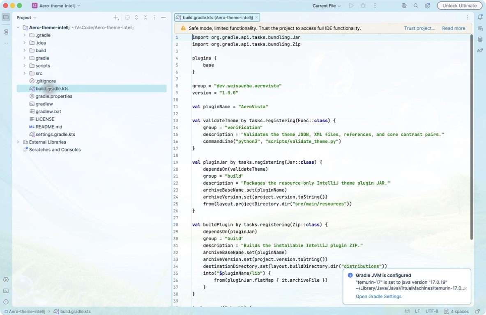

# AeroVista – Frutiger Aero Theme for IntelliJ

AeroVista ist ein helles Theme für die **Islands UI ab IntelliJ Platform 2025.3**. Es verbindet den optimistischen Frutiger-Aero-Look – Himmelblau, Aqua-Glas, sattes Grün, weiche Rundungen und ein eigenes Naturmotiv – mit einer ruhigen, kontrastreichen Arbeitsfläche.



## Design

- Glänzende Blau-/Aqua-Akzente für Navigation, Fokus und primäre Aktionen
- Helle, fast weiße Editor- und Tool-Window-Flächen für lange Arbeitssitzungen
- Klar unterscheidbare Hover-, Fokus-, Auswahl-, Warn- und Fehlerzustände
- Eigene Syntaxfarben für Java, Kotlin, JavaScript, Python, HTML/XML und weitere Sprachen
- Eigenes Frutiger-Aero-inspiriertes Hintergrundbild: dezent mit 9 % im Editor, kräftig im leeren Fenster
- Angepasste IntelliJ-Iconpalette und native Islands-Rundungen
- Sichtbar durchscheinende Dialoge (90 %), Menüs und schwebende Popups (92 %)
- Farbenfrohes Java-Semantik-Highlighting für Klassen, Methoden, Annotationen, Felder und Literale

## Installation

Die fertige ZIP-Datei liegt nach dem Build unter:

```text
build/distributions/AeroVista-1.1.2.zip
```

In IntelliJ IDEA:

1. **Settings → Plugins** öffnen.
2. Über das Zahnrad **Install Plugin from Disk…** wählen.
3. `AeroVista-1.1.2.zip` auswählen und die IDE neu starten.
4. Unter **Settings → Appearance & Behavior → Appearance → Theme** das Theme **AeroVista – Frutiger Aero** aktivieren.

## Build und Prüfung

Der Build läuft über den mitgelieferten Gradle Wrapper und benötigt eine lokale IntelliJ-IDEA-Installation sowie Python 3 für die Theme-Validierung:

```bash
./scripts/build.sh
```

Direkt über Gradle geht es ebenfalls:

```bash
./gradlew buildPlugin
```

Die Validierung prüft JSON/XML, referenzierte Assets, benannte Farben, PNG-Abmessungen und zentrale WCAG-Kontrastpaare.

## Kompatibilität

- IntelliJ Platform Build 253 oder neuer (2025.3+)
- IntelliJ IDEA, WebStorm, PyCharm, PhpStorm, GoLand, DataGrip, Rider und weitere JetBrains-IDEs mit Islands UI

Das Plugin ergänzt die statischen Theme-Ressourcen um einen kleinen lokalen UI-Controller, der ausschließlich bei Dialogen und schwebenden Fenstern eine dezente Deckkraft setzt. Es gibt keine Netzwerkzugriffe und keine Datenerfassung.
